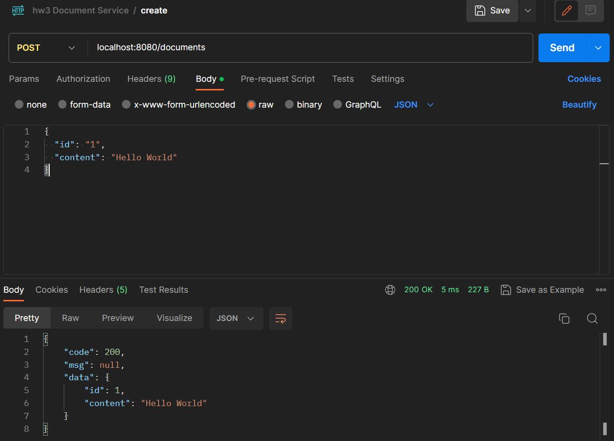
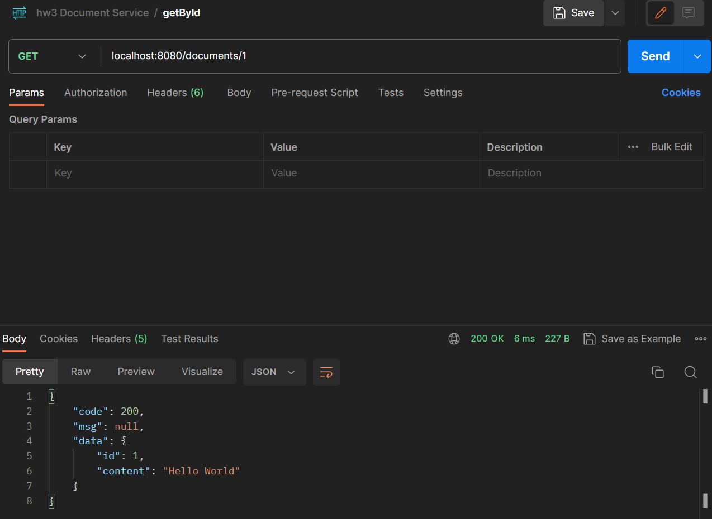
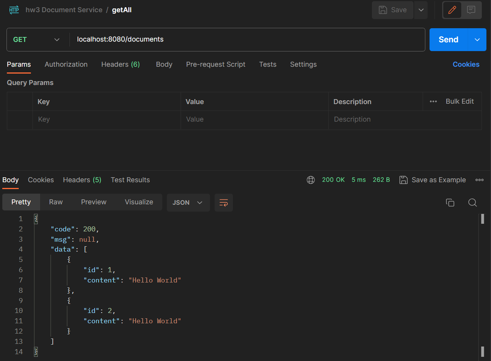
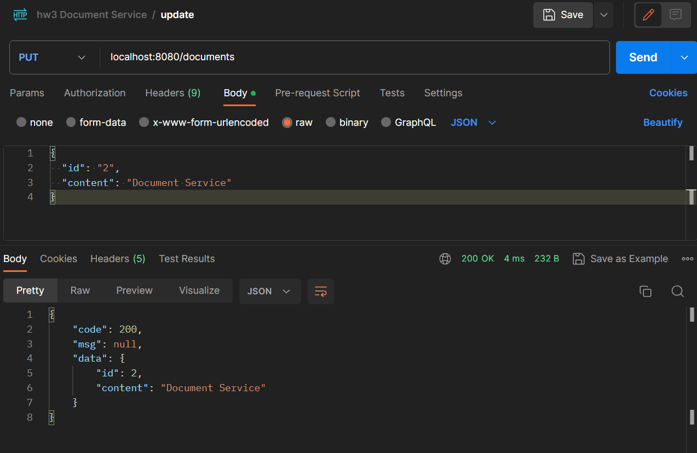
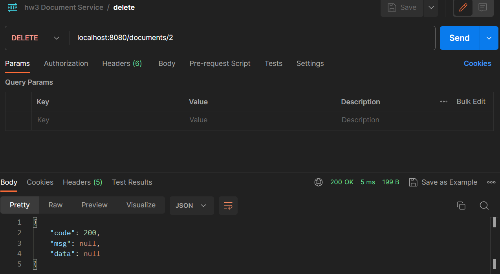

# DataBase & Spring

---
## Topic: Database
Use MySQL to build employee and salary table and solve the followings:
```mysql
CREATE TABLE employee (
    EmpId INT NOT NULL,
    FullName VARCHAR(25) NOT NULL,
    ManagerId INT NOT NULL,
    DateOfJoining DATE NOT NULL
);

INSERT INTO employee (EmpId, FullName, ManagerId, DateOfJoining)
VALUES
    (121, 'Jon Snow', 321, '2014-01-31'),
    (321, 'Night King', 986, '2015-01-30'),
    (421, 'Arya Stark', 876, '2016-11-27'),
    (521, 'Sansa Stark', 876, '2017-12-02'),
    (521, 'Sansa Stark', 876, '2017-12-02');
```

```mysql
CREATE TABLE salary (
    EmpId INT NOT NULL,
    Project VARCHAR(5),
    Salary INT NOT NULL
);

INSERT INTO salary (EmpId, Project, Salary)
VALUES (121, 'P1', 8000),
       (321, 'P2', 1000),
       (421, 'P1', 12000),
       (721, 'P3', 6000);
```
1. fetch the count of employees working in project 'P1'.
   ```mysql
   SELECT COUNT(EmpId) 
   FROM mydb.salary 
   WHERE Project='P1';
   ```
2. fetch employee names having salary greater than or equal to 5000 and less than or equal 10000.
   ```mysql
   SELECT FullName 
   FROM mydb.employee 
   WHERE EMPId IN (
     SELECT EmpId 
     FROM mydb.salary 
     WHERE Salary BETWEEN 5000 AND 10000
   );
   ``` 
3. fetch project-wise count of employees sorted by project's count condescending order.
   ```mysql
   SELECT Project, COUNT(EmpId) count 
   FROM mydb.salary 
   GROUP BY Project 
   ORDER BY count DESC;
   ```
4. fetch projects that include more than 1 employee
   ```mysql
   SELECT Project 
   FROM mydb.salary 
   GROUP BY Project 
   HAVING COUNT(EmpId) > 1;
   ```
5. fetch employee names and salary, if employee does not have salary, show salary as 0.
   ```mysql
   SELECT e.FullName, COALESCE(s.Salary, 0) 
   FROM mydb.employee e 
   LEFT JOIN salary s ON e.EmpId = s.EmpId;
   ```
6. fetch all employees whose managers are also in the employee table
   ```mysql
   SELECT * 
   FROM mydb.employee 
   WHERE ManagerId IN (
     SELECT EmpId 
     FROM mydb.employee
   );
   ```
7. fetch duplicate employee name in the employee table
   ```mysql
   SELECT FullName 
   FROM mydb.employee 
   GROUP BY FullName
   HAVING COUNT(*) > 1;
   ```
8. fetch employees who do not have salary
   ```mysql
   SELECT * 
   FROM mydb.employee 
   WHERE EmpId NOT IN (
     SELECT EmpId 
     FROM mydb.salary
   );
   ```
9. fetch current date and current timestamp
   ```mysql
   SELECT CURDATE() date, CURTIME() time;
   ```
10. fetch employee who joined in year 2016
   ```mysql
   SELECT * 
   FROM mydb.employee 
   WHERE YEAR(DateOfJoining) = 2016;
   ```
11. fetch employees and their salary who joined in "January"
   ```mysql
   SELECT e.EmpId, e.FullName, e.ManagerId, e.DateOfJoining, s.salary 
   FROM mydb.employee e
   JOIN salary s on e.EmpId = s.EmpId
   WHERE DATE_FORMAT(e.DateOfJoining, '%M') = 'January'; 
   ```

---
## Topic: Spring
### Write a document Service  
Implement APIs so that users can `create`/`delete`/`update`/`list`/`get` document(s).  
Please follow `RESTFUL API` design for http method, url path and return code.

A document class will look like:
```java
class Document{
    Integer id;
    String content;
}
```
Additional requirements:  
- `Create` API should handle the already existing error, and return proper http code.  
- `Get`/`Delete`/`Update` API should handle the not exist error, and return proper http code.
- Use Controller/Service/DAO to separate the logic. 
- In DAO, simply use a HashMap to store the document data.
- For `Create` API, the controller should only accept json http content and return proper http code if not json.

### Codes
#### Document Entity
```java
package com.ping.docservice.entity;

import lombok.Data;

import java.io.Serializable;

@Data
public class Document implements Serializable {
    public static final long serialVersionUID = 1L;
    Integer id;
    String content;

    public Document() {
    }

    public Document(Integer id, String content) {
        this.id = id;
        this.content = content;
    }
}
```
#### R Generic Respond Wrapper Class
```java
package com.ping.docservice.common;

import lombok.Data;

import java.io.Serializable;

/**
 * Generic Respond Wrapper Class
 * @param <T>: Class of Entity
 */

@Data
public class R<T>{

    private int code; // HTTP code
    private String msg;
    private T data;

    public static <T> R<T> success(T object){
        R<T> r = new R<>();
        r.code = 200;
        r.data = object;
        return r;
    }

    public static <T> R<T> error(int code, String msg){
        R<T> r = new R<>();
        r.code = code;
        r.msg = msg;
        return r;
    }
}
```
#### DocumentDao Interface
```java
package com.ping.docservice.dao;

import com.ping.docservice.entity.Document;
import org.springframework.stereotype.Repository;

import java.util.List;

@Repository
public interface DocumentDao {
    void create(Document doc);
    void delete(Integer id);
    void update(Document doc);
    List<Document> getAll();
    Document getById(Integer id);
}
```
#### DocumentDaoImpl
```java
package com.ping.docservice.dao;

import com.ping.docservice.entity.Document;
import org.springframework.stereotype.Repository;

import java.util.ArrayList;
import java.util.HashMap;
import java.util.List;

@Repository
public class DocumentDaoImpl implements DocumentDao{
    private final HashMap<Integer, String> documents;

    public DocumentDaoImpl(){
        documents = new HashMap<>();
    }
    @Override
    public void create(Document doc) {
        documents.put(doc.getId(), doc.getContent());
    }

    @Override
    public void delete(Integer id) {
        documents.remove(id);
    }

    @Override
    public void update(Document doc) {
        documents.put(doc.getId(), doc.getContent());
    }

    @Override
    public List<Document> getAll() {
        List<Document> docs = new ArrayList<>();
        documents.forEach((key, value) -> {
            Document doc = new Document(key, value);
            docs.add(doc);
        });
        return docs;
    }

    @Override
    public Document getById(Integer id) {
        return new Document(id, documents.get(id));
    }
}
```
#### DocumentService Interface
```java
package com.ping.docservice.service;

import com.ping.docservice.common.R;
import com.ping.docservice.entity.Document;

import java.util.List;

public interface DocumentService {
    R<Document> create(Document document);
    R<Document> delete(Integer id);
    R<Document> update(Document doc);
    R<List<Document>> getAll();
    R<Document> getById(Integer id);
}
```
#### DocumentServiceImpl
```java
package com.ping.docservice.service;

import com.ping.docservice.common.R;
import com.ping.docservice.dao.DocumentDao;
import com.ping.docservice.entity.Document;
import org.springframework.beans.factory.annotation.Autowired;
import org.springframework.stereotype.Service;

import java.util.List;

@Service
public class DocumentServiceImpl implements DocumentService{
    @Autowired
    DocumentDao documentDao;

    /**
     * Create API creates a new record
     * It handles the already existing error, and return general return object
     * @return '200' for successful creation; '409' for already existing error
     */
    @Override
    public R<Document> create(Document document) {
        System.out.println(documentDao.getById(document.getId()));
        if(documentDao.getById(document.getId()).getContent() != null){
            return R.error(409, "Document already exists");
        }
        documentDao.create(document);
        return R.success(document);
    }

    /**
     * Delete API deletes an existing record
     * It handles the not exist error
     * @return '200' for successful deletion; '409' for not exist error
     */
    @Override
    public R<Document> delete(Integer id) {
        if(documentDao.getById(id).getContent() == null){
            return R.error(409, "Document does not exist");
        }
        documentDao.delete(id);
        return R.success(null);
    }

    /**
     * Update API updates an existing record
     * It handles the not exist error
     * @return '200' for successful update; '409' for not exist error
     */
    @Override
    public R<Document> update(Document doc) {
        if(documentDao.getById(doc.getId()).getContent() == null){
            return R.error(409, "Document does not exist");
        }
        documentDao.update(doc);
        return R.success(doc);
    }

    /**
     * GetAll API gets all existing record
     * @return '200' for successful query;
     */
    @Override
    public R<List<Document>> getAll() {
        return R.success(documentDao.getAll());
    }

    /**
     * GetById API get an existing record by id
     * It handles the not exist error
     * @return '200' for successful query; '409' for not exist error
     */
    @Override
    public R<Document> getById(Integer id) {
        if(documentDao.getById(id).getContent() == null){
            return R.error(409, "Document does not exist");
        }
        return R.success(documentDao.getById(id));
    }
}
```
#### DocumentController
```java
package com.ping.docservice.controller;

import com.ping.docservice.common.R;
import com.ping.docservice.entity.Document;
import com.ping.docservice.service.DocumentService;
import org.springframework.beans.factory.annotation.Autowired;
import org.springframework.web.bind.annotation.*;

import java.util.List;

@RestController
@RequestMapping("/documents")
public class DocumentController {
    @Autowired
    private DocumentService documentService;

    @PostMapping
    public R<Document> create(@RequestBody Document document){
        System.out.println("Create...");
        return documentService.create(document);
    }

    @DeleteMapping("/{id}")
    public R<Document> delete(@PathVariable Integer id){
        System.out.println("Delete...");
        return documentService.delete(id);
    }

    @PutMapping
    public R<Document> update(@RequestBody Document updatedDocument) {
        System.out.println("Update...");
        return documentService.update(updatedDocument);
    }

    @GetMapping
    public R<List<Document>> getAll(){
        System.out.println("Get All...");
        return documentService.getAll();
    }

    @GetMapping("/{id}")
    public R<Document> getById(@PathVariable Integer id){
        System.out.println("Get by Id...");
        return documentService.getById(id);
    }
}
```

### Results
#### Post: `/documents`

#### GetById: `/documents/id`

#### GetAll: `/documents`

#### Update: `/documents`

#### Delete: `/documents/id`
